# Artificial Circuit Experiment — Product Manual
# 模拟电路实验 — 产品说明书

**exploring kid | Science Model Series**

> **English** | [中文](#中文说明)

---

## Table of Contents / 目录

- [Product Overview](#product-overview)
- [Parts List](#parts-list)
- [Assembly Instructions](#assembly-instructions)
- [Circuit Symbol Reference](#circuit-symbol-reference)
- [Experiments](#experiments)
  - [Exp 1: Current Characteristics of Electronic Components](#exp-1-current-characteristics-of-electronic-components)
  - [Exp 2: Directionality of Current & Rectification](#exp-2-directionality-of-current--rectification)
  - [Exp 3: Semiconductor Characteristics](#exp-3-semiconductor-characteristics)
  - [Exp 4: Brightness Control Circuit](#exp-4-brightness-control-circuit)
  - [Exp 5: Conductor & Insulator Test](#exp-5-conductor--insulator-test)
  - [Exp 6: Sound Amplifier Circuit](#exp-6-sound-amplifier-circuit)
  - [Exp 7: Short-Circuit Detection](#exp-7-short-circuit-detection)
  - [Exp 8: Multi-Frequency Oscillator](#exp-8-multi-frequency-oscillator)
  - [Exp 9: Transistor Amplifier](#exp-9-transistor-amplifier)
  - [Exp 10: Motor Speed Control](#exp-10-motor-speed-control)
  - [Exp 11: Radio Receiver Circuit](#exp-11-radio-receiver-circuit)
  - [Exp 12: Capacitor Delay Circuit](#exp-12-capacitor-delay-circuit)
  - [Exp 13: LED Auto Night-Light](#exp-13-led-auto-night-light)
  - [Exp 14: Light-Controlled Delay Switch](#exp-14-light-controlled-delay-switch)
  - [Exp 15: Sound-Triggered Flash Light](#exp-15-sound-triggered-flash-light)
  - [Exp 16: Sound-Controlled Delay Switch](#exp-16-sound-controlled-delay-switch)
- [Basic Principles](#basic-principles)
- [Safety Notices](#safety-notices)

---

## Product Overview

*Full bilingual product manual for the Artificial Circuit Experiment science model kit.*

This kit allows students to explore the characteristics of electronic components and understand the basic applications of analog circuits through hands-on experimentation.

> See `images/` folder for all diagrams and section illustrations.

---

## Parts List / 零部件清单

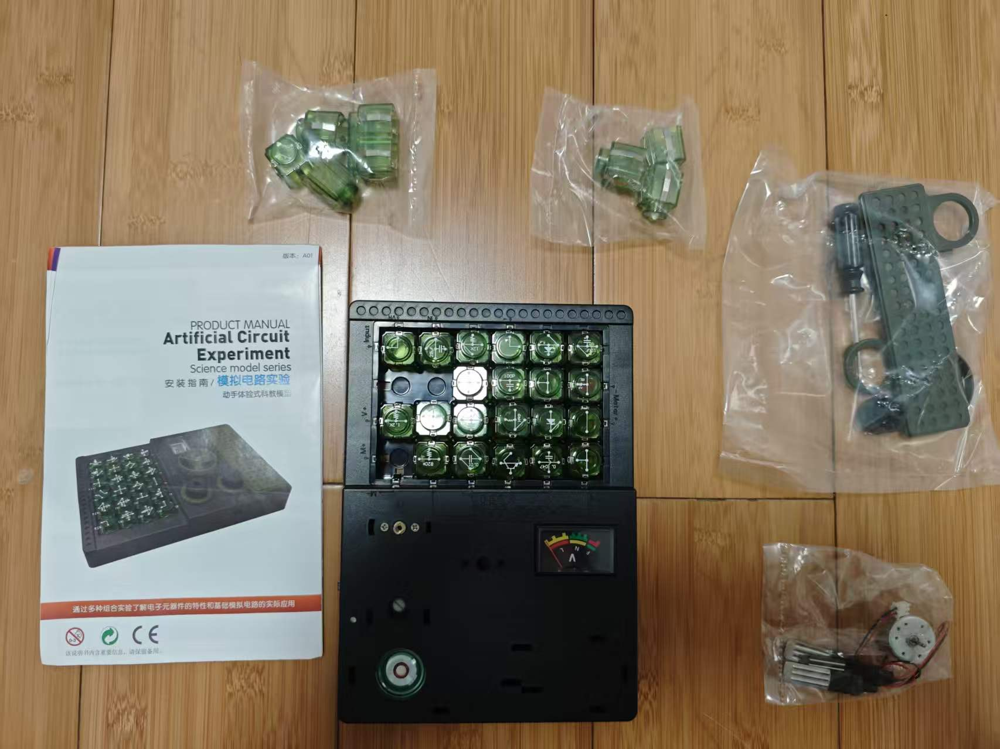

| Part | Qty | Part | Qty |
|------|-----|------|-----|
| Flat Screw (螺丝) | — | Pan-head Screw (平头螺丝, 2 types) | — |
| Carbon Film Resistor (挡板) | — | Potentiometer (调速扇) | — |
| Selection Module (选台袋组) | — | Base Unit (本体组件) | — |
| Selection Bracket (选台托架) | — | Motor (马达) | — |
| Connector Clip − (连接插片−) | — | Knife Switch (拨锐刀) | — |
| Connector Clip + (连接插片+) | — | Test Lead (测试架) | — |
| AA Battery × 3 (AA电池 3节) | — | Dual Module (双块模块) | — |
| Single Module × 3 (单块模块 3个) | — | — | — |

> ✦ All product images for reference only / 以所有产品实物为准，图片仅供参考

---

## Assembly Instructions / 怎样装配我们的产品？

### Step 1 — Assemble the Motor & Speed Controller / 组装马达与调速盘

1. Remove all modules from the body of the kit. Use 2 motors and 2 pan-head screws to attach them.

> **ZH:** 取出本体组件内的所有模块，备用。再取马达，用 2 颗较长螺丝轻松安装好。
> 

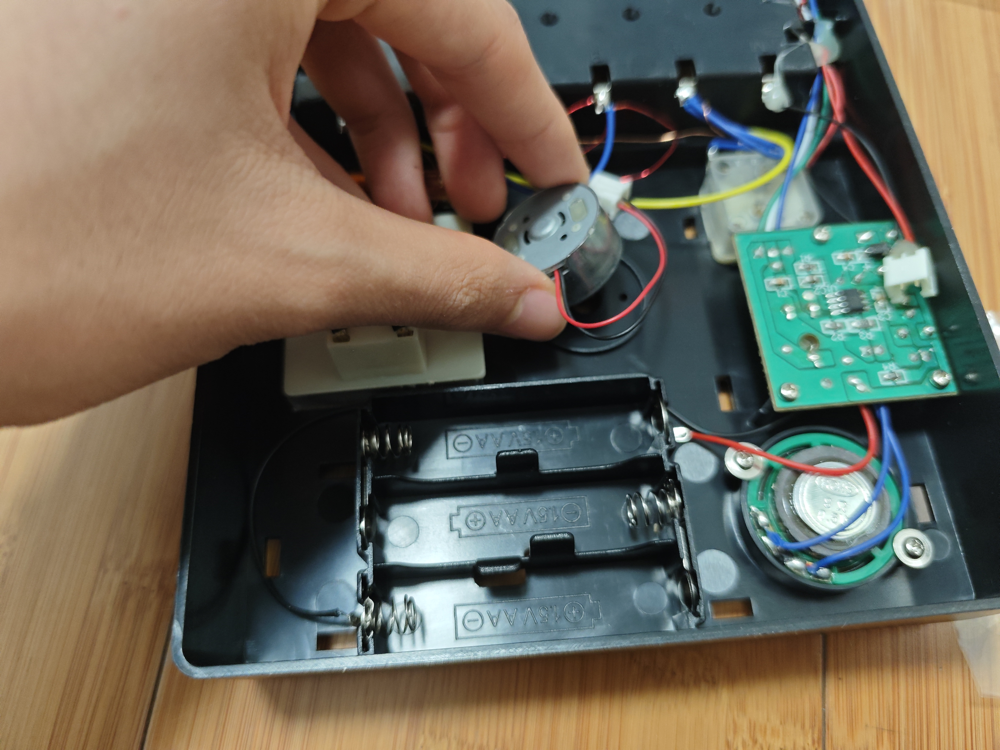

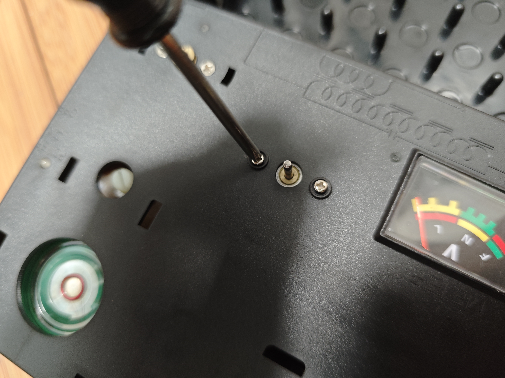

2. After assembly, use the speed controller dial (Fan-like) to adjust motor speed.

> **ZH:** 将调速扇用螺丝安装在马达上。

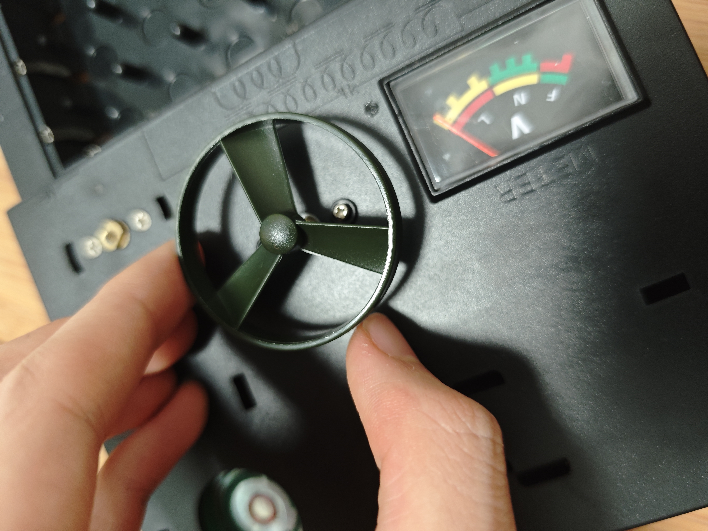

---

### Step 2 — Fix the Back Panel / 固定面板

1. As shown in Fig. , take the Carbon Film Resistor module and orient it in the direction shown, then attach it to the body unit.

> **ZH:** 如图，取出喇叭盖，按图示方向安装在本体组件上。

2. As shown in Fig. , take the Selection Module and secure it to the correct position.

> **ZH:** 如图，取出选台袋组，将其安装在正确位置。

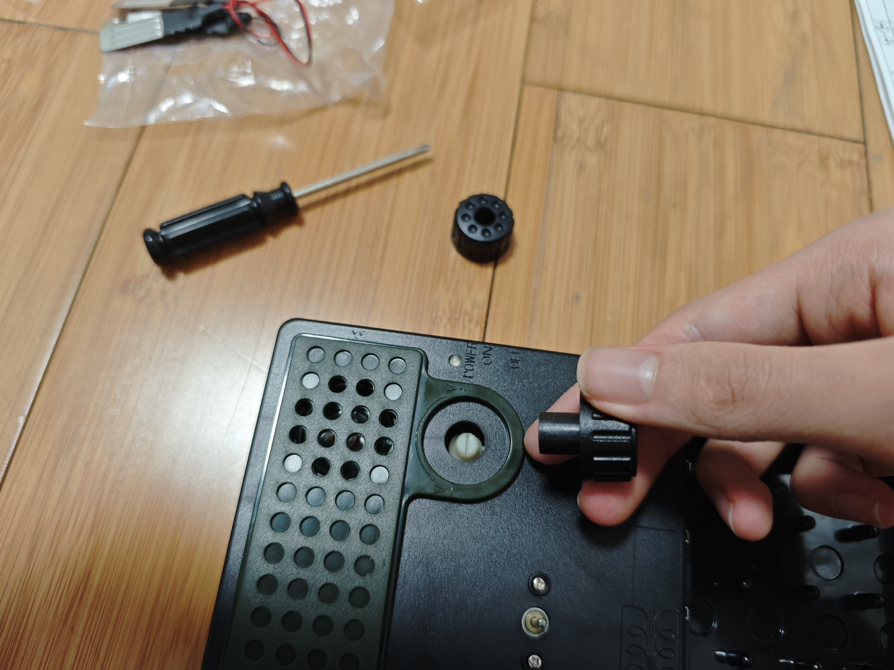
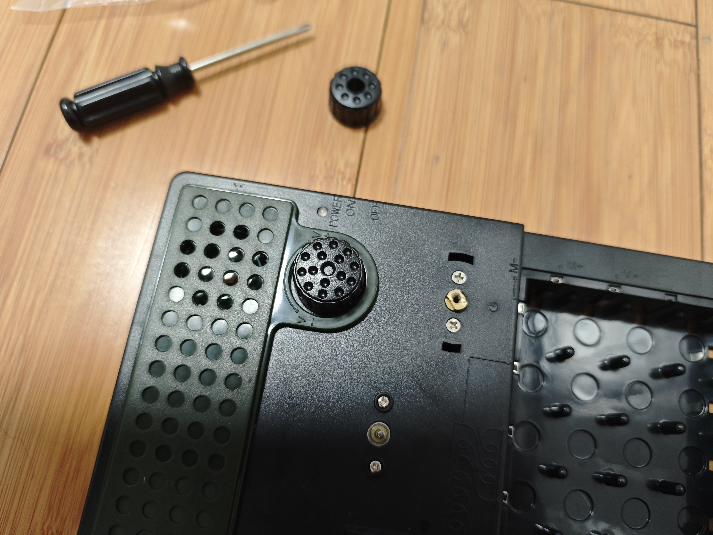

---

### Step 3 — Fix the Front Panel / 固定面板

1. As shown in Figs. , orient the panel in the direction shown and place it onto the body unit.

> **ZH:** 如图所示，取出此面板正面朝正确方向安装在本体组件上，再取螺丝将碳膜贴片固定在面板正确的位置（注意数量标记）。

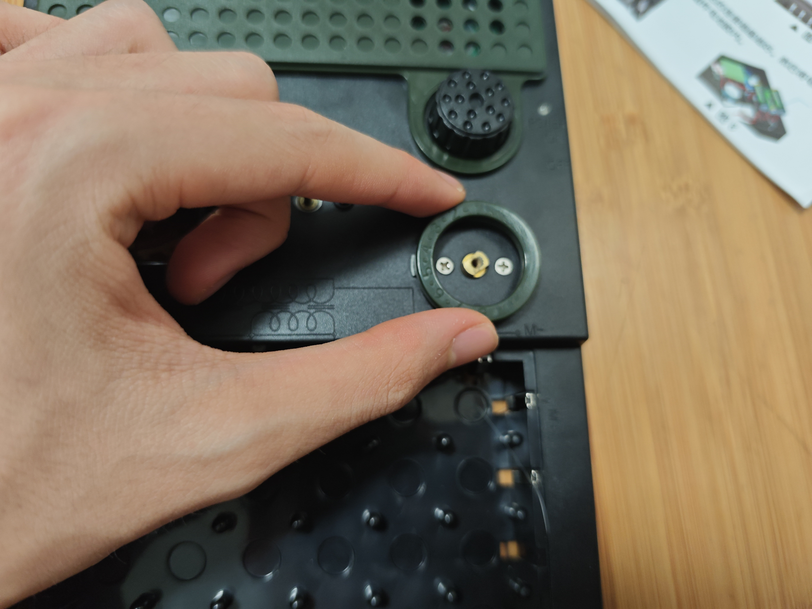

2.Use flat-head screws to secure the Carbon Film Resistor at the proper position (note the quantity marker).

> **ZH:** 再取螺丝将碳膜贴片固定在面板正确的位置（注意数量标记）。
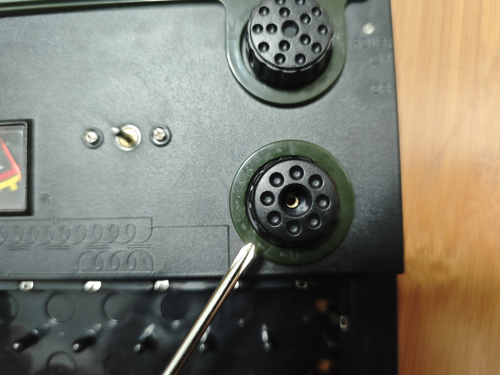
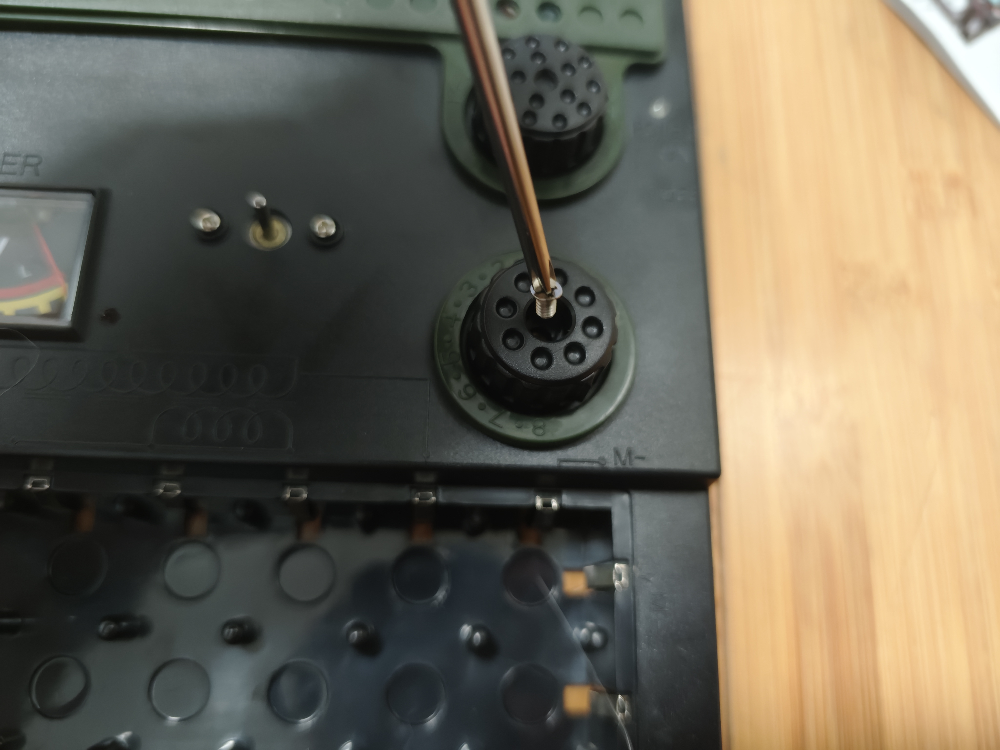
---

### Step 4 — Connect Motor Leads & Battery / 连接马达线与装电池

1. As shown in Figs., connect the motor leads to the motor terminals on the body unit. Turn the knife switch to "OFF", then insert 3 "AA" batteries.

> **ZH:** 如图，将连接线一端连接马达，另一端连接体上的马达接线口。然后将刀开关拨至“OFF”档，再取3节“AA”电池装入本体组件电池盒内。
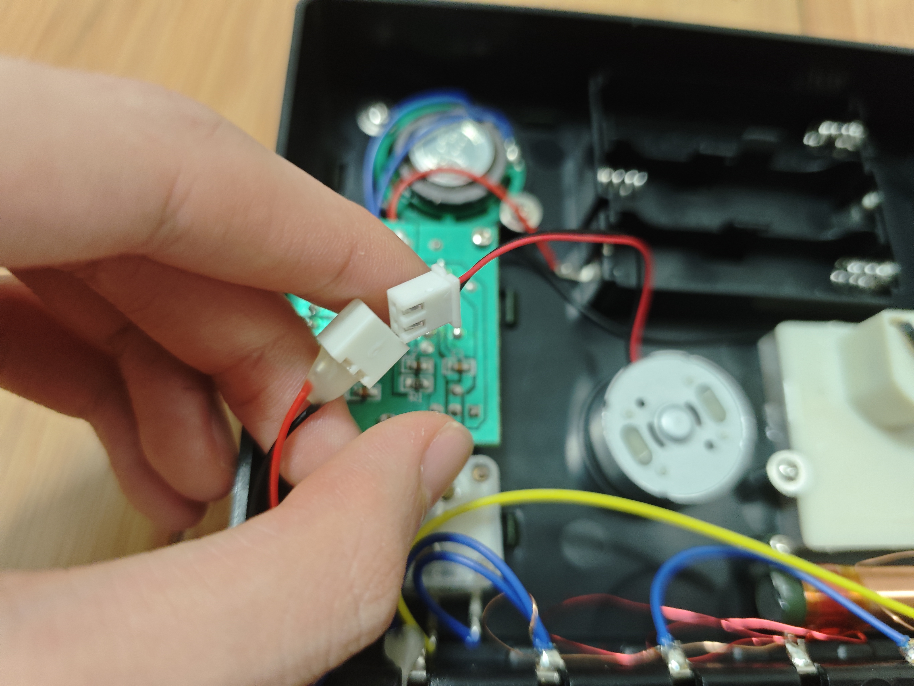

---

## Circuit Symbol Reference / 电路符号对照表

> Refer to this table when reading the schematic diagrams in each experiment.
> 阅读各实验中的电路原理图时，请参考此对照表。

---

## Important Notes / 实验前注意事项

> ⚠️ **Please read before beginning any experiment / 实验开始前请阅读**

1. Assemble and complete the circuit before powering on.
2. Multiple experiments may share the same power source.
3. Component positions in diagrams must be followed exactly.
4. After each experiment, turn the switch OFF before modifying the circuit.

---

## Experiments / 实验部分

### Exp 1: Current and Circuit Experiment
### 实验一：电流和电路实验

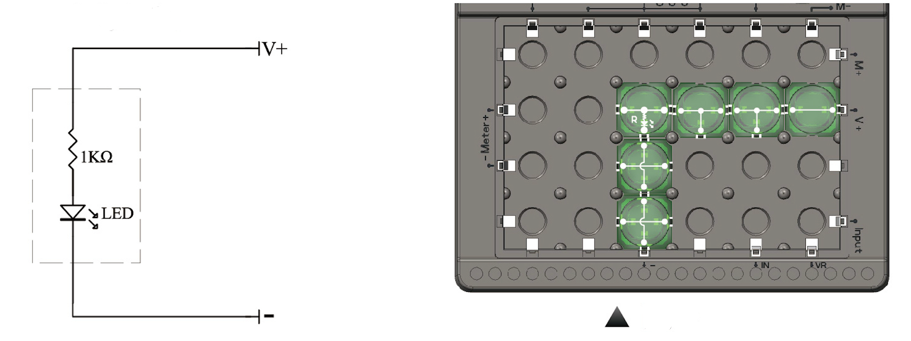

**Objective / 目标:** Understand how a circuit forms.

**Procedure / 步骤:**
1. Connect the Electronic Module shown in the Picture and turn the knife switch to **ON**.
2. The LED indicator would light up — this is the basic functioning state.
3. Remove one module, the LED would stop lighting.

**Key principle / 简要原理:** Circuits must need current flowing in it.

> **ZH:** 接按图将电子模块接上电子模块，开关开到“ON” LED灯会亮。通过实验知道，当电子模块一个一个插入时，每次插入后 LED灯越亮。实验中电子模块的数量越多，通过LED的电流越大。

---

### Exp 2: Directionality of Current & Rectification
### 实验二：电路方向性和整流作用实验

**Objective / 目标:** Understand how a diode controls current direction.

**Procedure / 步骤:**
1. Turn knife switch to **ON**; LED lights.
2. Insert a diode in forward orientation → LED stays on.
3. Reverse the diode 180° → LED turns off.
4. Conclusion: diodes only allow current in **one direction**.

> **ZH:** 接按图，开关到“ON” LED灯会亮。按图方向将二极管接入+一极电路，LED灯亮。将二极管调换方向，LED不亮。说明电流只能沿一个方向通过二极管。

---

### Exp 3: Semiconductor Characteristics
### 实验三：电晶体的特性实验

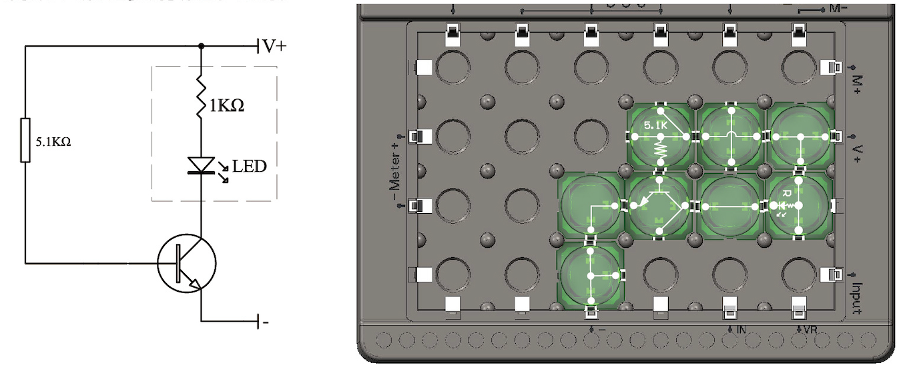

**Objective / 目标:** Explore transistor (NPN) current amplification.

**Procedure / 步骤:**
1. Turn to **ON**. Without base connection → LED off.
2. Connect large resistor to base → LED glows faintly.
3. Replace with smaller resistor → LED brightens significantly.
4. Conclusion: **transistors amplify current**.

> **ZH:** 接按图，开关开到“ON”，电路连接后，LED灯仍然不亮。当接上基极大电阵时，LED灯微微发亮。当换上小一些阻値的电阵时，LED灯变得较亮。来分析结论：晶体管有放大电流的功能。

---

### Exp 4: Brightness Control Circuit
### 实验四：灯亮度控制电路实验

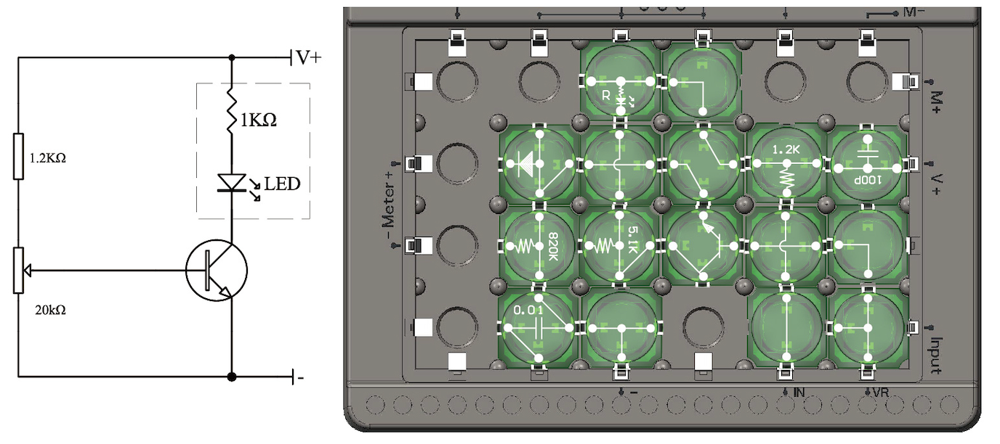
**Objective / 目标:** Use a potentiometer to control LED brightness via a transistor.

**Procedure / 步骤:**
1. Connect circuit with 20kΩ resistor and LED via transistor. Turn to **ON**.
2. Rotate the potentiometer: **more resistance → LED dims**; **less resistance → LED brightens**.

> **ZH:** 接按图，开关到“ON”。通过改变可变电阵的阻値，LED亮度可以发生变化。阻値越大，LED越暗；阻値越小，LED越亮。

---

### Exp 5: Conductor & Insulator Test
### 实验五：导体和络缘体实验

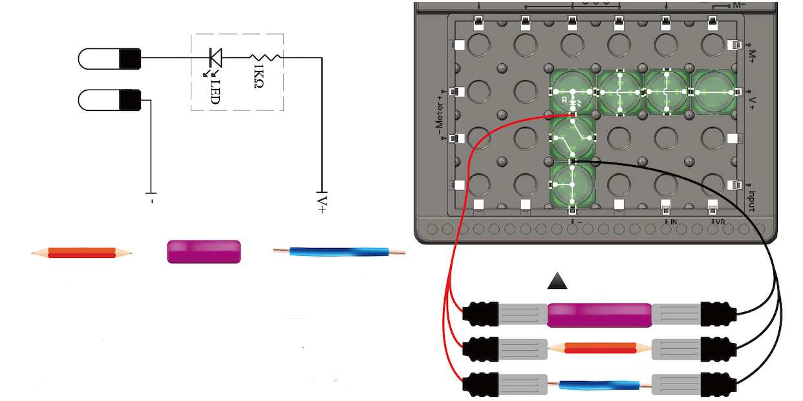
**Objective / 目标:** Identify which everyday materials conduct electricity.

**Procedure / 步骤:**
1. Assemble test circuit with LED indicator.
2. Touch probe tips to various materials.
3. LED **on** = conductor (导体); LED **off** = insulator (络缘体).

> **ZH:** 接按图，开关开到“ON”，取连接插片→和连接插片一，另一端任意将这两端接触日常物品的两面。电路两端接触导体时，LED灯会亮；接触络缘体，LED灯不亮。

---

### Exp 6: Sound Amplifier Circuit
### 实验六：声光播放器电路实验

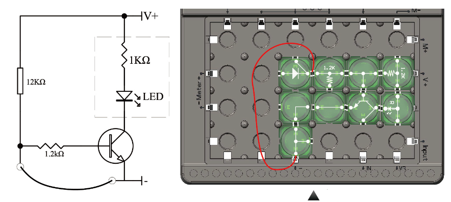
**Objective / 目标:** Build a sound-activated light display using a microphone.

**Procedure / 步骤:**
1. Connect circuit as in Fig. . Turn to **ON**.
2. Speak or play music near the microphone.
3. LED flashes in response to audio signals.

> **ZH:** 接按图，开关开到“ON”。在这个实验中通过声音输入到声音播放器电路，再由声光播放器电路来控制LED工作状态。

---

### Exp 7: Short-Circuit Detection
### 实验七：断路报知实验

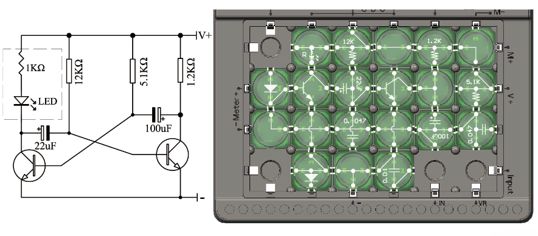

**Objective / 目标:** Detect open circuits using an LED indicator.

**Procedure / 步骤:**
1. Turn to **ON**. Connect Connector Clip to indicator position.
2. Tricolor LED turns on when circuit is complete.
3. When a break is detected in the circuit, LED changes color as a warning.

> **ZH:** 接按图电路后，开关开到“ON”，取连接插片→接到指示灯位置，电子模块插上电子模块。用刀开关开到“ON” LED灯亮。在这个实验中，LED是三色灯，从而了解灯的颜色变化是提示人进入警示区域的。

---

### Exp 8: Multi-Frequency Oscillator
### 实验八：多重振荡器电路实验

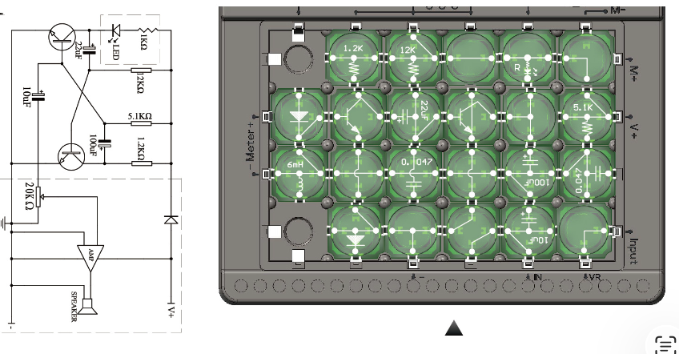
**Objective / 目标:** Observe oscillation and frequency control using transistors.

**Procedure / 步骤:**
1. Connect circuit as Fig. . Turn to **ON**.
2. Two LEDs blink alternately (astable multivibrator).
3. Change capacitor/resistor values to vary the blink rate.

> **ZH:** 接按图，开关开到“ON”。在这个实验中，我们发现LED等的闪烁频率在不断地变化，通过实验知道，让这个电路的工作频率从而引起多重振荡。

---

### Exp 9: Transistor Amplifier
### 实验九：电晶体的电流放大实验

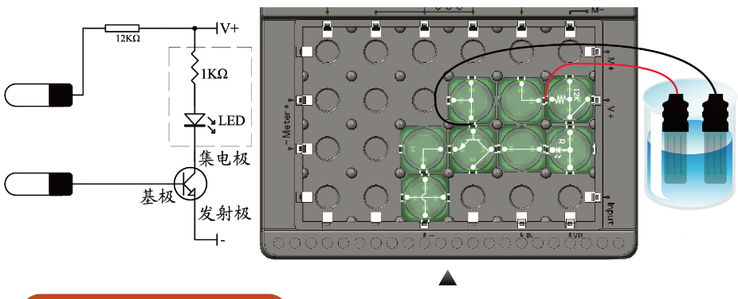

**Objective / 目标:** Demonstrate transistor current gain (β factor).

**Procedure / 步骤:**
1. Connect Electronic Module and turn to **ON**.
2. A small base current results in a significantly larger collector current (current gain β).

> **ZH:** 接按图，开关开到“ON”，连接指示灯到示意图位置，电路连接后，通过实验知道，这个电路中三极管的基极电流可以控制集电极电流，因此三极管有放大功能。

---

### Exp 10: Motor Speed Control
### 实验十：马达调速实验

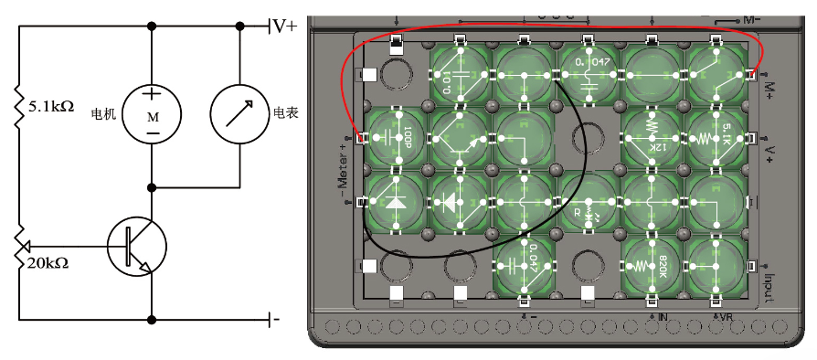
**Objective / 目标:** Control motor rotation speed using the potentiometer.

**Procedure / 步骤:**
1. Connect circuit as Fig. . Turn to **ON**.
2. Rotate the speed dial — motor speed changes accordingly.

> **ZH:** 接按图，开关开到“ON”，连接指示灯到示意图位置，指示针的左右动作是通过三极管振荡电路驱动马达产生的，调节可调电阵，可以改变马达的转速。

---

### Exp 11: Radio Receiver Circuit
### 实验十一：收音机实验

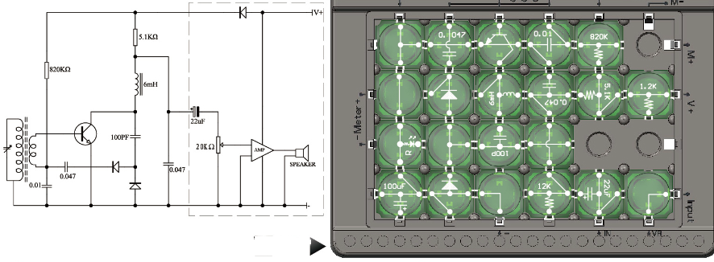

**Objective / 目标:** Build a simple AM radio receiver using LC tuning.

**Procedure / 步骤:**
1. Assemble antenna coil and connect circuit as Fig. . Turn to **ON**.
2. Use the tuning dial (选台袋组) to select a station.
3. LC resonant circuit tunes to the desired radio frequency.

> **ZH:** 接按图，本体使用了一个电感来放大天线信号。收音机电路是通过在接收天线电感中形成谐振，再通过放大级将之放大的方式来输出的。

---

### Exp 12: Capacitor Delay Circuit
### 实验十二：电容体组成延时电路实验

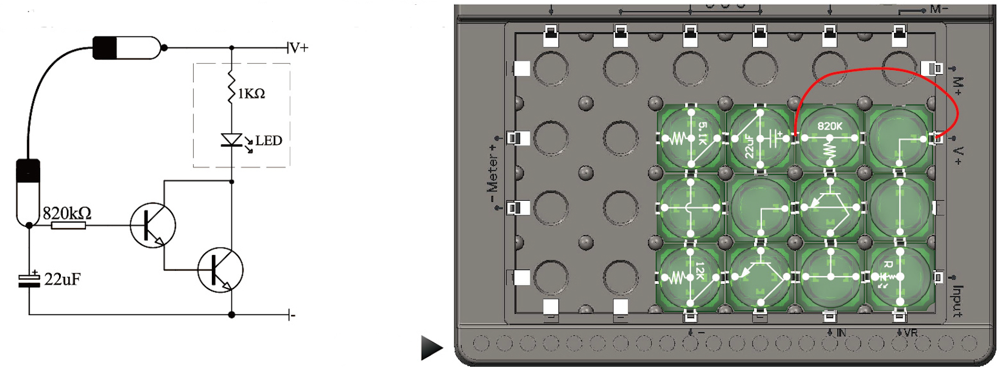
**Objective / 目标:** Observe how a capacitor creates a time delay (RC time constant).

**Procedure / 步骤:**
1. Connect as Fig. . Turn to **ON** — LED lights immediately.
2. Turn switch **OFF**.
3. LED does **not** turn off immediately — it gradually fades as capacitor discharges.

> **ZH:** 接按图，电源一接上，LED灯立即发亮。当断开电路后，LED灯也不会马上息灯，会慢慢变暗。这证明了电容器喂存电荷并慢慢释放的特性。

---

### Exp 13: LED Auto Night-Light
### 实验十三：LED 小按灯自动点亮电路实验

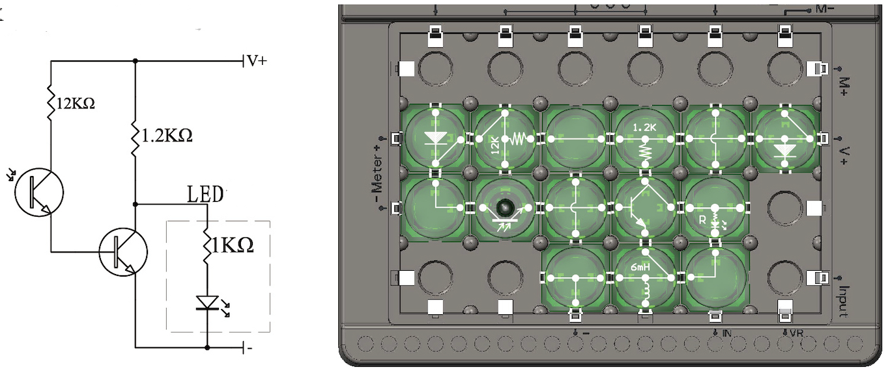

**Objective / 目标:** Build an automatic light that activates in darkness.

**Procedure / 步骤:**
1. Connect as Fig. . Turn to **ON**.
2. In bright light: LED **off**.
3. Cover the photoresistor (光敏电阴): resistance rises → transistor conducts → LED **on**.

> **ZH:** 接按图，处于白天有充足的阳光照射时，以阻挡光线越高，导通下面LED灯由此产生了自动点亮的功能。

---

### Exp 14: Light-Controlled Delay Switch
### 实验十四：光控延时开关电路实验

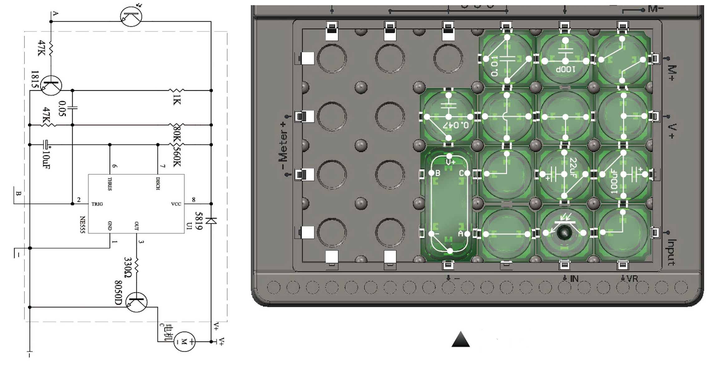
**Objective / 目标:** Build a light-activated switch with a time delay.

**Procedure / 步骤:**
1. Connect as Fig. . Turn to **ON**.
2. Block the photoresistor completely → after ~10 seconds, LED turns **on**.
3. Restore light → after ~10 seconds, LED turns **off**.

> **ZH:** 接按图，开关开到“ON”。在光照足够大时，光照消失，LED灯会延时约10秒后才息灯。这种光控延时开关可以结合路灯控制，实现到光线后延迟关灯功能。

---

### Exp 15: Sound-Triggered Flash Light
### 实验十五：声控闪光灯电路实验

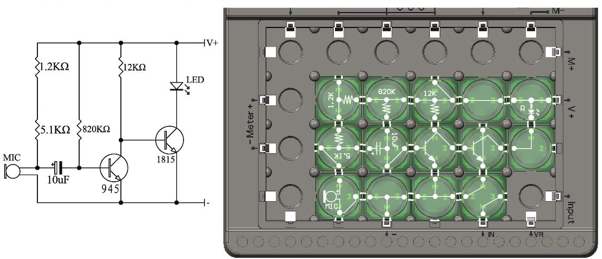
**Objective / 目标:** Build a circuit that flashes an LED in response to sound.

**Procedure / 步骤:**
1. Connect as Fig. . Turn to **ON**.
2. Clap or speak near microphone → LED flashes briefly.
3. Silence → LED off.

> **ZH:** 接按图，开关开到“ON”。对将3号声控闪光灯触发应用，通过声音大声呼叫使LED灯应声点亮闪光灯，声音消失，闪光灯停止工作。

---

### Exp 16: Sound-Controlled Delay Switch
### 实验十六：声控延时开关电路实验

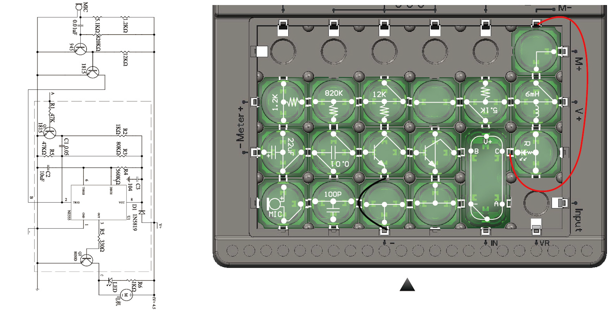
**Objective / 目标:** Build a voice-activated delay switch (staircase light principle).

**Procedure / 步骤:**
1. Connect as Fig. . Turn to **ON**.
2. Clap or make a loud sound → LED turns **on** immediately.
3. After ~10 seconds of silence → LED turns **off** automatically.

> **ZH:** 接按图，模拟LED灯亮点，马达开始，在 10 秒左右后停止。声控LED灯和马达工作后停止，可以实现声控延时开关工作。

---

## Basic Principles / 基本原理

### What is a Circuit? / 什么是电路？

An **electric circuit** is a closed loop through which electric current can flow, consisting of:

| Component | 中文 | Role |
|-----------|---------|------|
| Power source | 电源 | Provides voltage (EMF) |
| Conductor | 导线 | Carries current |
| Load | 负载 (灯、电机等) | Converts electrical energy |
| Switch | 开关 | Controls circuit on/off |

### Key Components / 元件工作原理

- **Diode (二极管):** One-directional current flow; used for rectification.
- **Transistor (三极管/晶体管):** Small base current controls large collector current — amplification & switching.
- **Capacitor (电容器):** Stores charge; creates time delays and filters signals.
- **Photoresistor (光敏电阴):** Resistance decreases as light increases — light sensing.
- **Electret Microphone (驻极体话筒):** Converts sound to electrical signals.

---

## Safety Notices / 安全注意事项

> ⚠️ **Please read all safety information before use / 使用前请阅读所有安全信息**

1. Always verify connections are correct before powering on.
2. Follow circuit diagrams exactly. Do not exceed rated voltages.
3. Keep metal tools away from battery contacts.
4. Do not put batteries in mouth. Store in a cool, dry place.
5. Use under adult supervision for children under 8.

> 🚨 **警告 / WARNING**
>
> Non-rechargeable batteries must **not** be recharged. Do not mix old and new batteries or different battery types. Always remove batteries when not in use. This product uses **AA × 3**.
>
> **ZH:** 非充电电池不能充电；充电电池在成人监护下充电；不同类型或新旧电池不得混用；不使用时应先取出电池；电池应正确插入电极性（+/−）；本产品使用“AA”电池 3节。

---

## Technical Specifications / 技术规格

| Parameter | Value |
|-----------|-------|
| Power Supply | 3 × AA batteries (4.5V DC) |
| Main Components | Transistor, Diode, LED, Capacitor, Photoresistor, Microphone |
| Suitable Age | 8 years and above (with adult supervision) |
| Standards | CE, FC, RoHS |

---

*Product Manual — Artificial Circuit Experiment, Science Model Series*
*产品说明书 — 模拟电路实验科教模型系列*

*© exploring kid / 探客少年 | 上海市静安区(中区) | 上海九科技管理有限公司 联合监制*
